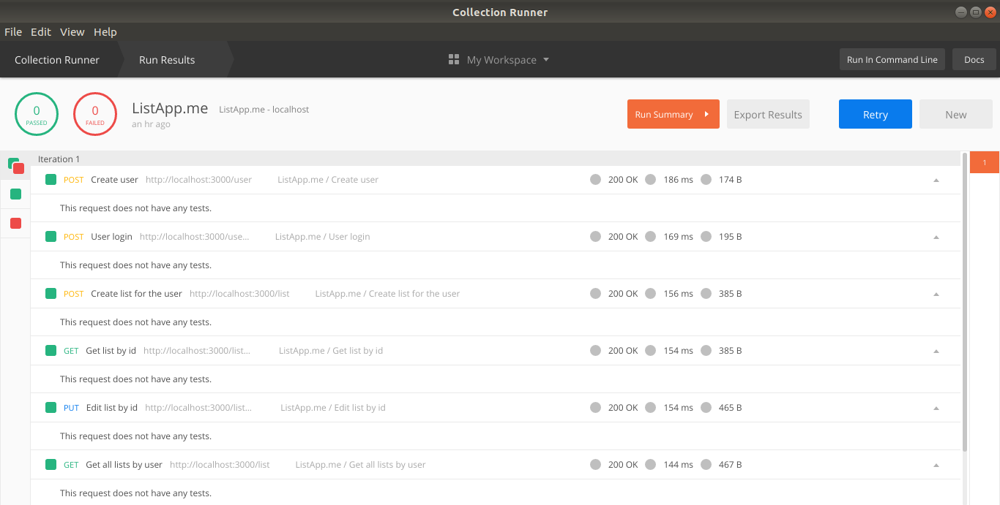

# ListApp.me - Back-end

> API Rest for list app in NodeJS using TypeScript and MongoDB.


## Environment Variables
Create the `.env.development` and `.env.production` files similar to the `.env.example` in `environments` folder.

## Build setup
First install [Node.js](https://nodejs.org/) and [Yarn](https://yarnpkg.com/).
```
# Install
$ yarn install

# Running on development
$ yarn run dev

# Running on development with Nodemon
$ yarn run watch:dev
```

## Docker container for production
Build with Docker:
```
# Create image
$ sudo docker build -t list-app .

# Running container
$ sudo docker run --env-file ./environments/.env.production -d -p 3000:3000 list-app
```

## Testing with Postman
Import the `postman_collection.json` and `postman_environment.json` files of `postman` folder on your Postman.



For details, see the [collections](https://www.getpostman.com/docs/v6/postman/collections/intro_to_collections) and [environments](https://www.getpostman.com/docs/v6/postman/environments_and_globals/intro_to_environments_and_globals) documentation.
